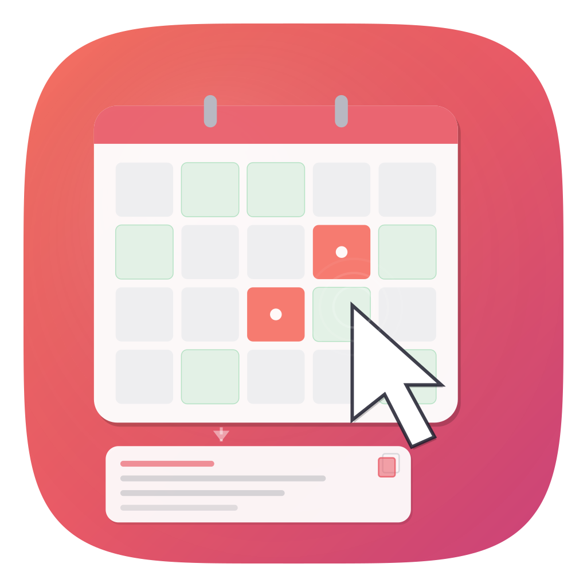

#  Availability Click

A macOS menu bar app that reads your calendars and copies your availability to paste into an email or chat. One click.

[Download the app](https://github.com/Reebz/availability-click/releases)

```
Mon Mar 30: 9-10:30am, 2-4pm
Tue Mar 31: 10am-12pm
Wed Apr 1: 9am-5pm
Thu Apr 2: 1-3:30pm
Fri Apr 3: 9-11am, 3-5pm
```

## Why I built this

I was typing "I'm free Tuesday 2-4 and Wednesday morning" into emails multiple times a day. Sometimes I'd get it wrong - a meeting I forgot about, a timezone I miscalculated - and the back-and-forth would start. My calendar already knew the answer. I just needed a way to get it out quickly.

Calendly solves this, but sending someone a scheduling link feels transactional. For the kinds of meetings I take - leadership syncs, cross-team alignment, exec conversations - I'd rather it feel like I wrote it myself. Because I did decide to send it. The app just did the typing.

No links for your counterpart to click. No accounts for them to create. A clean message that lands in their inbox looking like you took 30 seconds to check your calendar and type it out.

## Installation

[Download here](https://github.com/Reebz/availability-click/releases). Open the app, grant calendar access, done.

Requires macOS 14 (Sonoma) or later.

> Apple may warn you about opening a downloaded app. Right-click and select Open to get past it.

## How to use

1. Launch Availability Click from Applications
2. Grant calendar access when prompted
3. Left-click the calendar icon in your menu bar - availability copied to clipboard
4. Cmd+V into whatever you're writing.

Right-click the menu bar icon for longer date ranges, Settings, and Quit.

## What it does

**The basics**
- Left-click copies your availability for the default range
- Right-click gives you Next week, Next fortnight, or Next 30 days
- Option+click opens a preview so you can check the output before copying
- Ctrl+Shift+C copies from anywhere without touching the mouse (configurable)
- Reads every calendar synced to your Mac - iCloud, Google, Outlook, Exchange

**Smart about what counts as "busy"**
- Declined meetings don't block your time
- Cancelled events are excluded
- Events you've marked as "free" (focus time blocks, etc.) are excluded
- All-day events don't block time slots
- If you click on a Friday evening or weekend, it rolls forward to next week automatically

**Configurable**
- Working hours with 30-minute granularity (8:30am start, not just 9am)
- Working days - any combination, not just Mon through Fri
- Default range: "This week" or "Next 2-5 business days" with a slider
- Today buffer: minimum lead time before showing a slot (30 minutes to four hours)
- Calendar selection: pick which calendars count as "busy"
- Slot rounding: snap times to clean 5, 10, 15, or 30-minute boundaries
- Minimum slot duration: hide gaps shorter than 15, 30, 45, or 60 minutes
- Output format: plain text or Markdown
- Time zone with GMT offset

**Preview popover (Option+click)**
- See the formatted text before it hits the clipboard
- Timezone picker with search - convert to your recipient's local time before copying
- Format toggle - switch between plain text and Markdown
- Copy button puts exactly what you see on the clipboard.

## Privacy

No analytics. No tracking. No network connections. No data collection.

The app reads your calendar locally through Apple's EventKit framework. Nothing leaves your Mac. It runs inside the macOS App Sandbox with calendar access as the only entitlement - network permissions aren't even granted. There is physically no way for it to phone home.

## Technical details

- Swift 6, SwiftUI + AppKit
- EventKit, Combine, ServiceManagement
- Zero third-party dependencies
- XcodeGen for project generation
- macOS 14.0+ (Sonoma)
- 89 tests across eight suites
- App Sandbox, Hardened Runtime, Developer ID signed

## Support

If this saves you time, consider [buying me a coffee](https://buymeacoffee.com/reebz).<br>
<a href="https://www.buymeacoffee.com/reebz" target="_blank"></a>

## License

[MIT](LICENSE)
